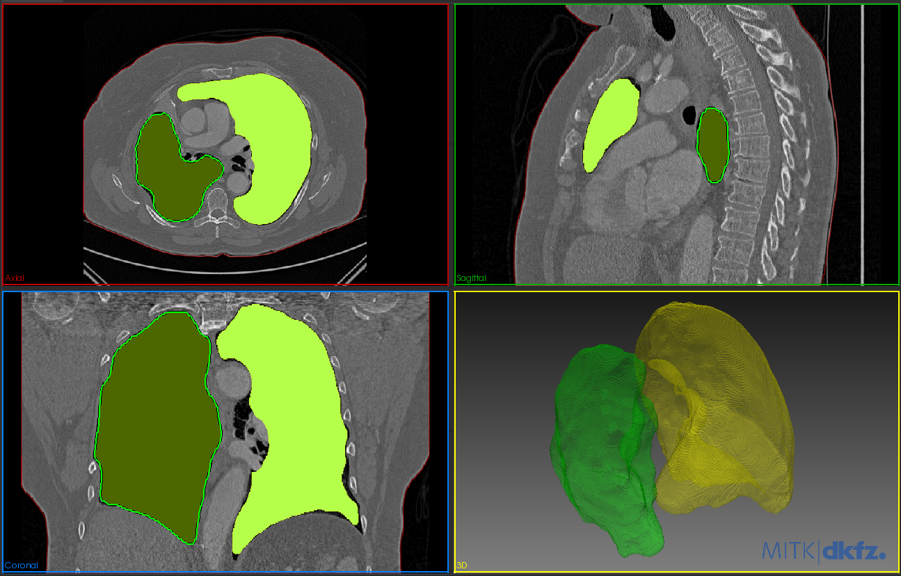
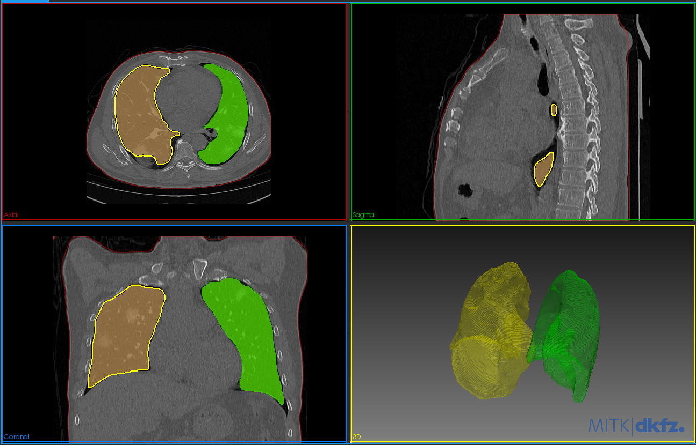
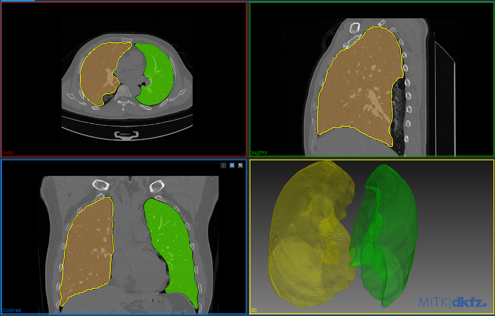

# segment_lungs
Segment lungs from CT images using threshold and morphological operations

---

###  This is a simple script to process the COVID-19 CT images.

[segment_lungs.py](./misc/segment_lungs.py)

1. Load a lung 3D CT scan
2. Plot a selected 2D slice
3. Normalise image intensities: 
    1. stretch intensity values distribution using percentiles
    2. standardise around mean value
    3. rescale [0-255]
4. Mask the body: 
    1. region growing
    2. morphological operations 
    3. connected components
5. Mask the lung: 
    1. threshold
    2. morphological operations 
    3. connected components

---

### Results

- The algorithm works fine for most of the cases
- If the right and left lung are connected, they may get segmented as one label (2-3 cases)
- It can miss infected lesions that appears with different intensity values than the lung's
- It won't work on bad converted nifti images from dicom, because of the weird intensity distribution

---
### Examples

Control 
 

Pathology
 

Pathology
 
